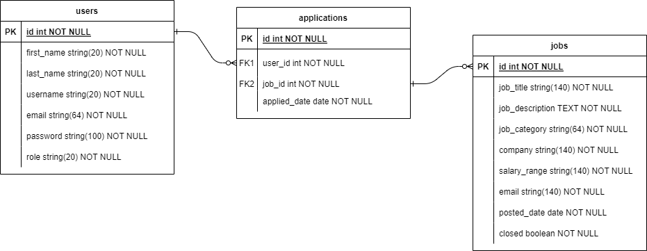

# Find Jobs Web Application

## Description of the application

Find Jobs is an web application that allows employers to post job listings and job seekers to apply for those job listings. The web application is built using the Flask web framework and incorporates features such as user authentication using Flask-Login, the Forms made using Flask-wtf, database integration with Flask-SQLAlchemy, and API integration with Flask-RESTful & Requests.

The Find Jobs web application has several key functionalities, including the ability for employers to create new job listings with details such as -  

        1. Job title 
        2. Salary range
        3. Company
        4. Job category
        5. Job description and
        6. Email address will be taken from the current_user (Flask-Login)
    
Job seekers can search for job listings based on Job title or description, and also filter the jobs using the Job category dropdown. Job seekers can apply for jobs by simple clicking on the apply job button.

In addition to these core functionalities, the Find Jobs web application also has a page where it shows detailed information of the particular Job by clicking on the Job title. If the manager is logged in job detail page will display a table additionally to get the information of the number of applicants for the jobs that manager has been posted in the job listings.

Furthermore to these core functionalities, The Job listing page will show "Already appiled" tag to the job if the current user logged in as the job applicant and addtionaly "withdraw job" button will be available to withdraw the Job application.

Overall, Find Jobs web application provides a convenient and streamlined way for job seekers to find job listings and for hiring manager to manage their hiring process.

#

## Contributors

Ravi Teja Geddada - (mailto:rgeddada@clarku.edu)

#

## Database design

#

## Run configuration

-   Download the zip file and extract in some folder in the Virtual Machine
-   Create the database by the following command

        CREATE DATABASE jobs_webapp;

-   To run the flask application in two different ports. First, Open the frontend folder in the VS Code and open the new VS Code window for backend folder. Then run the following command in both the terminals. 
        
        python main.py

#

## Find Jobs Web Application Screenshots

